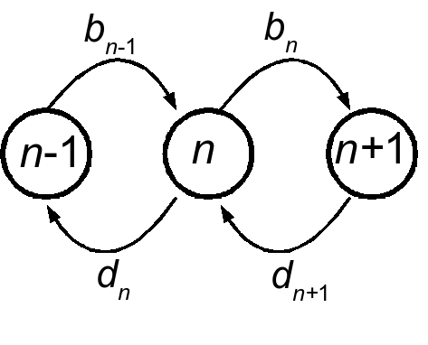

```{r include=FALSE, message=FALSE}
knitr::opts_chunk$set(echo = FALSE, message=FALSE, warning=FALSE)
library(ggthemes)
library(tidyverse)
library(cowplot)
library(hrbrthemes)
extrafont::loadfonts()
extrafont::font_import()
hrbrthemes::import_roboto_condensed()
ggplot2::theme_set(hrbrthemes::theme_ipsum_rc())
#ggplot2::theme_set(theme_bw())
```


<!--

We hope that these papers will combine a mix of synthetic reviews of the current state of an area, as well as insights into how the field has developed during the last twenty years, discussion of current important questions, and developments and insights that would significantly advance the field. Although certainly not necessary, if there are any past Ecology Letters papers that have had a profound impact on the development of an area – be it beneficial or not – a brief discussion of that impact would be appropriate. We also hope that articles will be written in a thoughtful style, but also provocative if appropriate.


Key questions

Key advances


Noise -> informer


Shift from noise as nuiance to noise as opportunity
Stochastic phenomena outside of theory -- early warning signals

Need for greater tanslation


Population-level vs ABM vs IBM


Discuss out of scope:  
 - behavior
 - evolutionary dynamics examples?? 


Bialek's rules
1. Noise isn't negligible: photon counting, chemotaxis, 
2. No fine tuning: developmental patterning? ion channels/ stochastic switches? 
3. Efficient representation: entropy, information flow

-->


# Outline

## What is noise? 

<!-- Our state variables don't "exist" except as averages of a lower level process -->

Where does noise come from?  It is important to bear in mind that whenever stochasticity is introduced into a model, it is only as a simplification or summary of the effects of a large number of other processes, often occuring at different scales.  Simply put, *noise is all that we leave out of our model*.  While ecologists will sometimes assert that stochasticity is inherent: birth and death are inherently stochastic events; or the environment is inherently stochastic, these are only assertions at a particular scale.  Obviously events such as births and deaths are themselves the results of mechanistic processes, just as fluctuations in rainfall and temperature are the result of deterministic laws of physics and not fundamentally random forces.  In all of science, only quantum mechanics claims a fundamentally probabilistic view of events, and then at such scales that have no relevance to ecology.  The term "noise" itself reflects this emergent rather than fundamental origin: the combination of hundreds of voices and sounds each individually distinct blends together into a background of noise.  

## Noise the nuisance: Noise can obscure patterns

Stochasticity is most often thought of as something which obscures patterns we are trying to infer.  This is a simple consequence of modeling: as discussed above, variables of interest to the processes in question are modeled explicitly (e.g. change in population density as it depends on the current density), everything else is just noise.  Most statistical inference in ecology is built solely to deal with this problem: pulling back the veil of noise to reveal processes of interest.  Unfortunately, given the high levels of variation and relatively limited data typical in ecological analyses, this can be a significant challenge, and even as statistical and computational advances provide more powerful and accessible inference tools, the task only gets harder.  For instance, few ecological concepts are more central than the notion of density dependence: that competition in some form or other should limit a species ability to grow without bound.  Yet establishing statistical evidence for density dependence is remarkably difficult, as illustrated by a landmark study of @Knape2011.  Using time series from the Global Population Dynamics Database (GPDD) @Knape2011 show that once one accounts for the potential for measurement error in addition to environmental stochasticity -- an unavoidable source of noise in most ecological data -- it becomes difficult to find evidence for even the simplest models of density dependence in the majority of avaialble time series.  Faced with such uncertainty, it is tempting to throw up our hands and wait until some prophesized deluge of streaming microsensors stapled to every organism provide enough signal to beat back the noise. Fortunately, this has not been the path taken.  

<!-- Should we make explicit or only implicit reference to Ecology Letters? -->

<!-- okay, claiming this for the last 2 decades might be overly provocative?-->

Over the past twenty years, ecological theory, modelling, and methods have increasingly elucidated the role of noise not only to *obscure* patterns but to *create* them.  This period marked a transistion away from the intense focus on simple models which exhibited deterministic chaos that had enchanted much of theoretical ecology in the decade prior in favor of more complex and stochastic models.  Of particular interest has been those conceptual advances that have bridged the divide from theoretical to empirical interest -- not merely the introduction of "real data" in a theoretical paper, but rather the concepts that take on a life of their own in the larger research community.  

Our first stop will be into research into the origins of noise.  This will not only let us set up definitions for terms and concepts we will encounter throughout, but also introduce some of the fundamental mathematical and computational tooling needed in our tour of noisy phenemena.  From origins of noise, we will then explore some of the phenomena that noise can create.  These examples are central to the conceptual transistion away from viewing noise only as a nusiance that obscures patterns and realize the rich set of patterns and phenomena that can emerge.  Our tour will be by no means exhaustive, but as with chaos before it, theoretical allure does not always reflect ecological releveance.  Instead, we will pivot to our third 

<!-- Origins -->

<!-- Phenomena --> 

<!-- Applications --> 

<!-- Connection to empiricists.  Not the same thing as connection to data. --> 


## Origins of noise


## Sources of noise


**Demographic stochasticity**.  Demographic stochasticity refers to fluctuations in population sizes or densities that arise from the fundamentally discrete nature of individual birth and death events.  Demographic stochasticity is a particularly instructive case for illustrating a mechanism for how noise arises as an aggregate description from a fundamentally lower-level mechanistic process.  We summarize the myriad lower-level processes that mechanistically lead to the event of a 'birth' in the population as a probability: in a population of $N$ identical individuals at time $t$, a birth occurs with probability $b_t(N_t)$ (_i.e._ a rate that can depend on both the population size $N$) and increases the population size, $N$ to $N+1$, and deaths occur with probability $d_t(N_t)$, decreasing the population size, $N$ to $N-1$.  Assuming each of these events are independent, this is a Poisson process.  

<!-- Master equation transform--> 

<!-- Demographic noise scaling with population size -->


<!-- Gillespie algorithm -->




[@Black2012]

**Environmental stochasticity**.  Whereas demographic noise reflects processes at a lower scale (the individual, rather than the population), environmental stochasticity reflects processes operating at the same scale that we are not explicitly modelling.  

[@Black2012]

Colored noise e.g. [@Marshall2015]


<!-- Identify as beyond the scope of this paper -->

**Individual heterogeneity**

[@Hart2016]

**Spatial variability**


In addition to these sources of variation, there are additional sources of variation or uncertainty in a model which we will not consider for the purpose of this review which, while related, operate in a fundamentally different way that does not give rise to the same phenomena and information.  


**Observational error**: Observational error acts much like another form of stochasticity, arising from
sampling effects or limitations of instruments, etc. Yet unlike the sources described above, this 
uncertainty does not impact the actual state of our system, and thus does not give rise to any
additional phenomena or information about that process. 

### Not noise


**Reducible uncertainty**: In constructing and estimating mathematical models of ecological processes, 
we encounter uncertainty over our parameter estimates and possible choice of models [@Ellison2004].  In some ways, this
uncertainty can act like the stochasticity described above: for instance, both introduce variation into
any forecast of future outcomes. Yet unlike stochasticity, this uncertainty is reducible: with additional
observations, we can narrow the uncertainty over parameters or candidate models, while stochasticity remains an
inherent source of variation. We will this not consider model and parameter uncertainty, as they are not 
sources of noise.


**Chaos**: Deterministic chaos [@Desharnais2001] is another mechanism of introducing significant variation into a simple model. Chaos can a look a lot like noise: indeed, it can be observationally indistinguishable from a stochastic process [@Werndl2009].  Despite substantial interest in previous decades and the relative ease of encountering chaos in simple ecological models (particularly in differences equations), and convincing reconstructions of chaotic dynamics in laboratory manipulations [@Costantino1997] the prevelance of chaotic dynamics as a driving factor in most ecological systems remains unclear. Meanwhile, the undeniable influences of 


Figure: schematic showing types of noise

<!-- blah blah fixed effects vs random effects -->

- deterministic skeletons, 
- signal-to-noise ratio, 
- model fitting


## Noise the creator: Noise can induce novel phenomena


Stochasticity can give rise to a wide array of interesting phenomena that are often at odds with our intuition. 


**Quasi-cycles**


Understanding the origin of sustained oscillations has long been a central question in ecology [@Hastings1996].  The simple Lotka Volterra model produces only neutrally stable centers, while the more realistic model that introduces carrying capacity for prey as they compete for resources results in a model that produces only damped oscillations, eventually settling into a stable state (Figure 1a).

$$x_{t+1} = x_t + x_t r \left(1 - \frac{x_t}{K}\right) - b x_t  y_t + \epsilon_t$$
$$y_{t+1} = y_t + c  x_t  y_t - d  y_t+ \xi_t $$


```{r}
read_csv("appendix/quasicycles.csv") %>%
  gather(species, population, -t, -sigma) %>%
  rename(time = t) %>%
  ggplot(aes(time, population, col = species)) + geom_line() + 
  facet_wrap(~ sigma) + scale_color_ptol() #+ 
#  labs(x="Time", 
#       y="Population density",
#       title="Noise induces quasi-cycles",
#       caption="Left panel: neglible  noise results only in damped oscillations.\nRight panel: small noise creates sustained oscillations.")
#ggsave("figures/quasicycles.pdf")
```


- Power spectrum

[@Black2010] 
[@Blarer1999]


**Stochastic switching**

Stochastic fluctuations can also drive spontaneous shifts between alternative stable states.  

```{r}
read_csv("appendix/noisy_switch.csv")  %>% ggplot(aes(t,x)) + 
  geom_line() #+ 
  #labs(title="Stochastic switching", 
  #     subtitle = "Noise drives transitions between alternative stable states")
#ggsave("figures/noisy_switch.pdf")

```


- transition probabilities, waiting times

**Inflation**

Stochasticity can 

<!-- two concurrent flat lines makes for a poor figure -->

**Persistence and coexistence**

One of the most fundamental aspects of stochasticty are the implications for long-term persistence of any given population and the stable coexistence of interacting species.  

**Bet hedging**


**Further examples**


@Read2007 <!-- Stochasticity generates an evolutionary instability for infectious disease -->

- Critical transitions


[@Schreiber2008] decreasing variance before crash

- Spatial pattern formation 

Turning patterms found in plankton-herbivore dynamics [@Levin1976]

- Population persistence (bet-hedging)


Individual heterogeneity: spatial spread? persistence? 

- Species coexistence  ([@Hart2016])


## Noise the informer: Noise can provide novel information

One of the most interesting aspects of noise is as a source of additional information.  Noise can act like a miniature perturbation experiment, constantly perturbing a system away from an equilibrium to reveal it's behavior elsewhere in state space.  

- Measuring stability


**Early warning signals.**  The theory of early warning signals, or critical slowing down (csd) [@Wissel1984; @Scheffer2009] is an instructive example 


<!-- @Holling1996 is responsible for the introduction of the unfortunate term "Engineering Resilience" to mean precisely the same thing as mathematicians and theoretical ecologists have refered to as 'stability' for decades.  Further confusion has been sown by the introduction of the energy-potential diagram into ecology, where the depth of the potential well is not a local property-->


```{r}
tipping <- read_csv("appendix/tipping.csv") 

p1 <- tipping %>%
  select(-x) %>%
  gather(series, value, -t, -tip_time) %>%
  ggplot(aes(t, value)) + geom_line() + 
  geom_vline(aes(xintercept = tip_time), col="red", lty=2) +
  facet_wrap(~series, ncol = 2, scales="free_y") # +
#  theme_ipsum_rc() +
#  labs(title="A: Early warning signs")

p2 <- tipping %>% 
  select(t, population = x, tip_time) %>%
  ggplot(aes(t, population)) + geom_line() + 
  geom_vline(aes(xintercept = tip_time), col="red", lty=2) #+ 
#  scale_y_log10() # + 
#  theme_ipsum_rc() + 
#  labs(title="B: Population density",
#       caption = "Vertical red dashed line indicates tipping point location")

library(cowplot)
ggdraw() +
  draw_plot(p2, x = 0, y = 0, width = 1, height = 0.5) +
  draw_plot(p1, x = 0, y = .5, width = 1, height = 0.5)
#ggsave("figures/tipping.pdf")
```


Challenges remain in distinguishing these patterns from other causes [@Boettiger2013a] which will ultimately require more domain-specific information  [@Boettiger2013b]. 

<!-- FIXME unclear, rambling!-->
It is important to realize that such approaches can only ever measure local properties such as the return time in response to local perturbation (historically termed *stability*; which @Holling1996 landmark chapter unforunately rebrands as "engineering resilience") and not global properties such as the size of the attractor basin / distance to the nearest tipping point (*ecological resilience*, or simply *resilience*).  This is illustrated rather vividly in @Dai2015, which illustrates how a system can lose resilience before losing stability, resulting in a scenario that provides less opportunity for early warning.


## Conclusions

## References